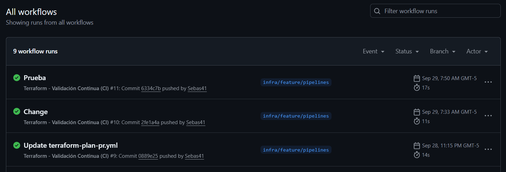

# Microservices App Infrastructure - Terraform

Este proyecto implementa una infraestructura de microservicios en Azure utilizando Terraform, con patrones de diseño de **Load Balancer** y **Autoscaling** para garantizar alta disponibilidad y escalabilidad.

## Estrategia de Branching Operaciones / Infraestructura

- `infra/main` : infraestructura productiva  
- `infra/dev` : infraestructura de pruebas  
- `infra/feature/*` : cambios de Terraform o scripts de despliegue  

### Reglas generales de Pull Request (PR)

- Las PRs deben ser revisadas por al menos un revisor  
- Debe ejecutarse `terraform plan` (o comando equivalente) como validación  
- No se permite merge directo a ramas protegidas sin pasar las validaciones  

## Arquitectura de la Infraestructura

### Componentes Principales

- **Load Balancer (Azure Load Balancer)**: Distribuye el tráfico entre múltiples instancias
- **Virtual Machine Scale Sets (VMSS)**: Proporciona autoscaling automático
- **Azure Cache for Redis**: Cache compartido para los microservicios
- **Red Virtual (VNet)**: Red privada con subnets segmentadas
- **Log Analytics**: Monitoreo y logging centralizado

## Patrones de Diseño Implementados

### 1. Load Balancer Pattern

#### Implementación
```hcl
# Load Balancer principal
resource "azurerm_lb" "main" {
  name                = "${var.project_name}-lb"
  location            = azurerm_resource_group.rg.location
  resource_group_name = azurerm_resource_group.rg.name
  sku                 = "Standard"
}
```

#### Características del Load Balancer:
- **SKU Standard**: Soporte para alta disponibilidad y zonas de disponibilidad
- **Health Probes**: Verificación de salud de las instancias backend
- **Backend Pool**: Grupo de instancias que reciben el tráfico
- **Load Balancing Rules**: Reglas de distribución del tráfico

#### Configuración de Health Probes:
```hcl
resource "azurerm_lb_probe" "frontend_probe" {
  name            = "frontend-probe"
  loadbalancer_id = azurerm_lb.main.id
  protocol        = "Http"
  port            = 80
  request_path    = "/"
}
```

### 2. Autoscaling Pattern

#### Implementación con Virtual Machine Scale Sets (VMSS)

Cada microservicio se implementa como un VMSS independiente:

```hcl
module "frontend" {
  source               = "./modules/vmss"
  name                 = "${var.project_name}-frontend"
  instance_count       = 0  # Escalado a 0 inicialmente
  vm_size              = "Standard_B1s"
  subnet_id            = azurerm_subnet.app.id
  # ... más configuración
}
```

#### Características del Autoscaling:
- **Escalado Horizontal**: Aumento/disminución del número de instancias
- **Upgrade Mode Automático**: Actualizaciones sin downtime
- **Integración con Load Balancer**: Las nuevas instancias se agregan automáticamente al backend pool
- **Configuración Flexible**: Cada microservicio puede tener diferentes configuraciones de escalado

#### Microservicios Implementados:
1. **Frontend** (0 instancias iniciales)
2. **Auth API** (1 instancia)
3. **Users API** (0 instancias iniciales)
4. **Todos API** (0 instancias iniciales)
5. **Log Processor** (1 instancia)

## Infraestructura de Red

### Segmentación de Red
```hcl
# Red Virtual principal
resource "azurerm_virtual_network" "vnet" {
  name                = "${var.project_name}-vnet"
  address_space       = ["10.0.0.0/16"]
}

# Subnet para aplicaciones
resource "azurerm_subnet" "app" {
  name           = "snet-app"
  address_prefixes = ["10.0.1.0/24"]
}

# Subnet para Load Balancer
resource "azurerm_subnet" "lb" {
  name           = "snet-lb"
  address_prefixes = ["10.0.2.0/24"]
}

# Subnet para Redis
resource "azurerm_subnet" "redis" {
  name           = "redis"
  address_prefixes = ["10.0.3.0/24"]
}
```

### Beneficios de la Segmentación:
- **Aislamiento de Servicios**: Cada componente en su propia subnet
- **Seguridad**: Control granular del tráfico de red
- **Escalabilidad**: Facilita el crecimiento de la infraestructura

## Servicios de Datos

### Azure Cache for Redis
```hcl
resource "azurerm_redis_cache" "redis" {
  name                = "${var.project_name}-redis"
  location            = azurerm_resource_group.rg.location
  resource_group_name = azurerm_resource_group.rg.name
  capacity            = 1
  family              = "C"
  sku_name            = "Standard"
}
```

**Propósito**: Cache compartido para sesiones, datos temporales y optimización de rendimiento.

## Monitoreo y Logging

### Log Analytics Workspace
```hcl
resource "azurerm_log_analytics_workspace" "la" {
  name                = "${var.project_name}-loganalytics"
  location            = azurerm_resource_group.rg.location
  resource_group_name = azurerm_resource_group.rg.name
  sku                 = "PerGB2018"
  retention_in_days   = 30
}
```

**Características**:
- Retención de logs por 30 días
- SKU PerGB2018 para optimización de costos
- Integración con todos los servicios de Azure

## Despliegue

### Prerrequisitos
1. **Azure CLI** instalado y configurado
2. **Terraform** >= 1.2.0
3. **SSH Key** para acceso a las VMs
4. **Azure Subscription ID**

### Variables Requeridas
```hcl
# terraform.tfvars
subscription_id = "your-subscription-id"
admin_ssh_key   = "ssh-rsa AAAAB3NzaC1yc2EAAAADAQABAAABgQC..."
```

### Comandos de Despliegue
```bash
# Inicializar Terraform
terraform init

# Planificar el despliegue
terraform plan

# Aplicar la configuración
terraform apply
```

## Escalabilidad y Alta Disponibilidad

### Estrategias Implementadas:

1. **Load Balancing**:
   - Distribución automática del tráfico
   - Health checks para detectar instancias no saludables
   - Failover automático

2. **Autoscaling**:
   - Escalado horizontal basado en métricas
   - Configuración independiente por microservicio
   - Actualizaciones sin downtime

3. **Redundancia**:
   - Múltiples instancias por servicio
   - Distribución en zonas de disponibilidad
   - Backup automático de datos

## Configuración de VMSS

### Características Técnicas:
- **OS**: Ubuntu 22.04 LTS
- **VM Size**: Standard_B1s (1 vCPU, 1 GB RAM)
- **Storage**: Standard_LRS
- **Upgrade Mode**: Automático
- **SSH Access**: Configurado con clave pública

### Extensibilidad:
El módulo VMSS soporta:
- Scripts de inicialización personalizados
- Configuración de backend pools para load balancers
- Tags personalizados por servicio

## Outputs del Despliegue

```hcl
# IP pública del Application Gateway
output "application_gateway_public_ip" {
  value = azurerm_public_ip.agw_pip.ip_address
}

# Información de Redis
output "redis_hostname" {
  value = azurerm_redis_cache.redis.hostname
}

# IDs de todos los VMSS
output "vmss_ids" {
  value = [
    module.frontend.vmss_id,
    module.authapi.vmss_id,
    module.usersapi.vmss_id,
    module.todosapi.vmss_id,
    module.log_processor.vmss_id,
  ]
}

```

## Validación Continua con GitHub Actions (CI/CD)

Este repositorio incluye un workflow de **GitHub Actions** (`.github/workflows/terraform-validate.yml`) que valida automáticamente la sintaxis y el formato de los archivos Terraform cada vez que se realiza un push a las ramas (excepto `main` e `infra/dev`).



### Flujo del Workflow

1. **Disparadores (`on`)**  
   - Se ejecuta en cada `push` a ramas distintas de `main` e `infra/dev`.  
   - Esto asegura que los cambios en ramas de features se validen antes de abrir un PR.  

2. **Configuración del entorno**  
   - Define la variable `tf_working_dir` para indicar el directorio donde se ejecuta Terraform.  
   - Corre en `ubuntu-latest`.  

3. **Pasos principales**  

   - **Checkout del repositorio**  
     Descarga el código fuente con historial completo (`fetch-depth: 0`).  

   - **Configurar Terraform**  
     Instala Terraform usando la acción oficial de HashiCorp.  

   - **Terraform Init (sin backend)**  
     Inicializa Terraform sin conectarse al backend remoto (`-backend=false`), ideal para validaciones ligeras.  

   - **Terraform Format (auto-fix)**  
     - Ejecuta `terraform fmt` en todos los archivos para aplicar el formato oficial.  
     - Si hay archivos modificados, los lista y prepara para commit automático.  

   - **Auto-commit de archivos formateados**  
     - Si hubo cambios de formato, se realiza un commit automático con el mensaje:  
       `chore(tf): auto format with terraform fmt`  

   - **Terraform Validate**  
     Ejecuta `terraform validate` para asegurar que la sintaxis y dependencias son correctas.
---

